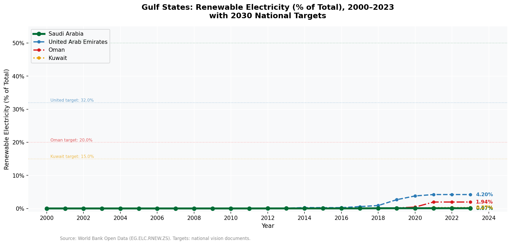
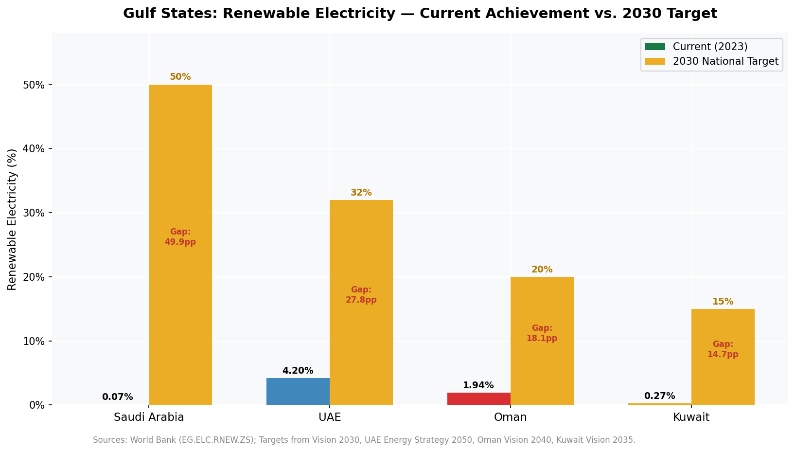
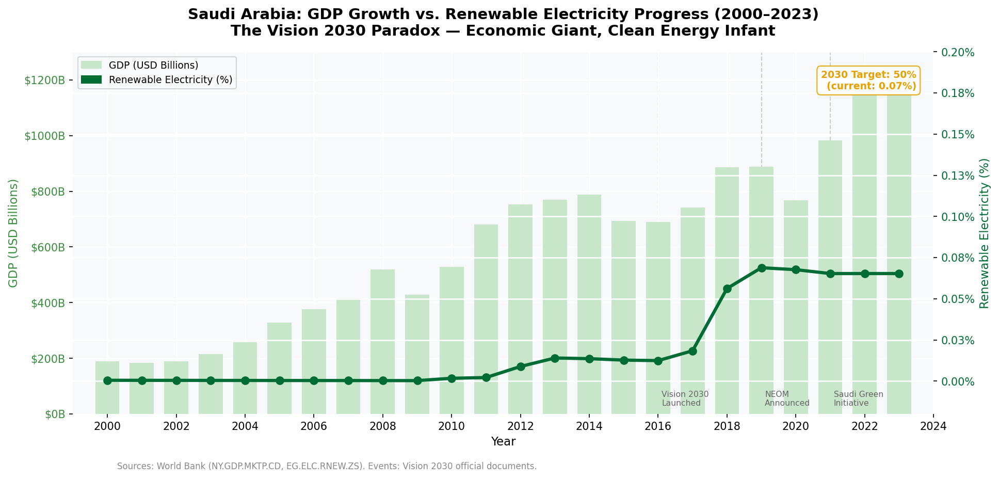
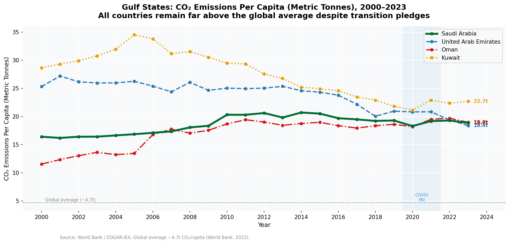
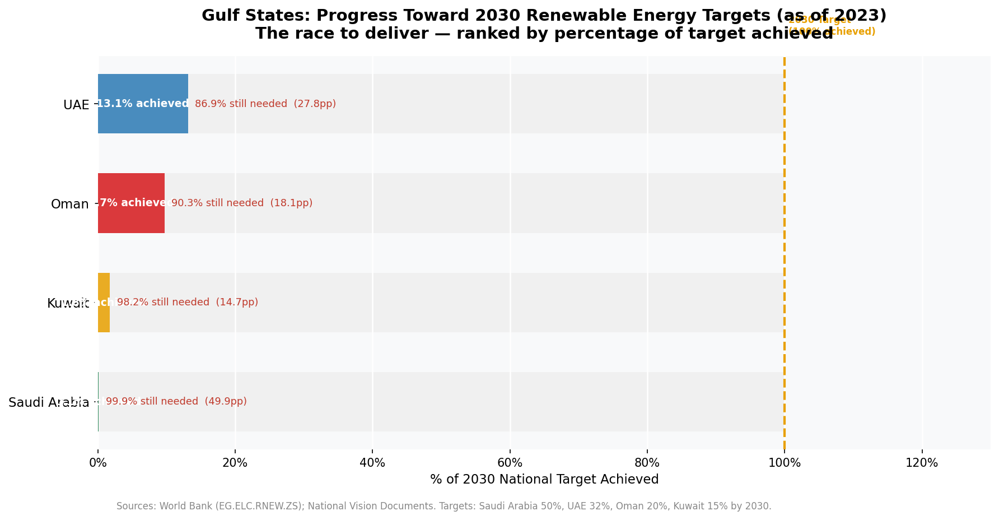

# Targets vs. Reality: Mapping the Gulf's Renewable Energy Gap (2000–2023)


---

## Project Overview

This project analyses the gap between national renewable energy targets and actual
delivery across four Gulf Cooperation Council (GCC) economies — Saudi Arabia, UAE,
Oman, and Kuwait — from 2000 to 2023.

The analysis is framed from a **data consulting perspective**, producing findings
directly relevant to energy sector investors, sustainability advisors, and Gulf
government ministries working on Vision 2030, UAE Energy Strategy 2050,
Oman Vision 2040, and Kuwait Vision 2035.

---

## Business Question

> *Which Gulf state faces the largest renewable energy delivery gap relative to its
> 2030 national target — and what does the data reveal about the pace of transition
> required?*

---

## Key Findings

| Country | Current (2023) | 2030 Target | Gap | % of Target Achieved |
|---------|---------------|-------------|-----|----------------------|
| **Saudi Arabia** | 0.07% | 50% | 49.9pp | **0.1%** |
| **Kuwait** | 0.27% | 15% | 14.7pp | **1.8%** |
| **Oman** | 1.94% | 20% | 18.1pp | **9.7%** |
| **UAE** | 4.20% | 32% | 27.8pp | **13.1%** |

**No Gulf state is currently on a trajectory to meet its 2030 renewable target.**

### Summary of Findings

1. **Saudi Arabia's gap is structurally alarming** — the Kingdom has committed to
   50% renewable electricity by 2030 but has achieved just 0.07% as of 2023.
   To meet its target, renewable share must grow by approximately 7 percentage
   points per year — a pace never achieved by any Gulf state in the historical record.

2. **UAE is the clear regional leader** — 4.2% achieved against a 32% target,
   driven by Masdar solar investments and the Barakah nuclear programme.
   Progress is visible but still far from sufficient.

3. **Oman is the quiet reform model** — most consistent delivery pace relative
   to target size, aligned with broader fiscal and economic diversification progress
   under Vision 2040.

4. **All four countries emit CO₂ per capita far above the global average** —
   Kuwait leads at ~23.7 tonnes vs. a global average of ~4.7 tonnes.
   Without renewable deployment at scale, emissions trajectories remain
   structurally elevated regardless of net-zero pledges.

5. **Saudi Arabia's GDP grew from ~$200B (2000) to over $1 trillion (2022)**
   while renewable electricity remained near-zero — confirming that economic
   growth under Vision 2030 has not yet translated into clean energy delivery.

---

## Consulting Recommendation

Saudi Arabia requires an accelerated dual-track renewable strategy:

**Track 1 — Utility-Scale Solar at Speed**
Al Shuaibah-scale projects (2+ GW) must transition from exceptional to routine.
NEOM and the Red Sea Project offer grid-scale renewable integration opportunities
that should be treated as national infrastructure priorities.

**Track 2 — Grid Modernisation**
Generation without transmission upgrades cannot reach consumers. Saudi Arabia's
current grid infrastructure cannot absorb the renewable capacity implied by a
50% target — grid investment must parallel generation investment.

---

## Charts Produced

| Chart | Description |
|-------|-------------|
|  | **Renewable Trajectory** — All 4 countries 2000–2023 with 2030 target lines |
|  | **Target vs. Reality** — Current achievement vs. 2030 national target |
|  | **Saudi Arabia Deep-Dive** — GDP growth vs. renewable electricity progress |
|  | **CO₂ Per Capita** — Emissions trajectories vs. global average |
|  | **Gap-to-Target Race** — % of 2030 target achieved, ranked |

---

## Project Structure

```
gulf-renewable-energy-analysis/
│
├── data/
│   ├── raw/                          ← World Bank CSV files (not tracked)
│   └── cleaned/
│       ├── gulf_master.csv           ← All 4 countries merged (96 rows × 13 cols)
│       ├── gulf_renewable_clean.csv  ← Renewable data with targets and gaps
│       ├── saudi_arabia.csv          ← Saudi Arabia slice
│       └── oman.csv                  ← Oman slice
│
├── notebooks/
│   ├── 01_data_cleaning.ipynb        ← Load, clean, validate, merge, save
│   └── 02_exploratory_analysis.ipynb ← 5 analytical charts + findings
│
├── visuals/                          ← 5 exported PNG charts (150 DPI)
├── requirements.txt
└── README.md
```

---

## Data Sources

| Dataset | Indicator Code | Source |
|---------|---------------|--------|
| Renewable electricity (% of total) | EG.ELC.RNEW.ZS | World Bank Open Data |
| CO₂ emissions per capita | EN.ATM.CO2E.PC | World Bank / EDGAR-IEA |
| GDP, current USD | NY.GDP.MKTP.CD | World Bank Open Data |
| Energy use per capita | EG.USE.PCAP.KG.OE | World Bank Open Data |

National 2030 targets sourced from:
- Saudi Arabia: Vision 2030 / Saudi Green Initiative (sgi.gov.sa)
- UAE: UAE Energy Strategy 2050 (moei.gov.ae)
- Oman: Oman Vision 2040 (oman2040.om)
- Kuwait: Kuwait Vision 2035 / Kuwait EPA Low Carbon Strategy 2050

---

## Tools & Technologies

| Tool | Purpose |
|------|---------|
| Python 3.14 | Core programming language |
| Pandas | Data loading, cleaning, transformation |
| NumPy | Numerical calculations |
| Matplotlib | Chart production (5 publication-quality charts) |
| Jupyter Notebook | Interactive analysis environment |

---

## How to Reproduce

**1. Clone the repository**
```bash
git clone https://github.com/YOUR_USERNAME/gulf-renewable-energy-analysis.git
cd gulf-renewable-energy-analysis
```

**2. Install dependencies**
```bash
pip install -r requirements.txt
```

**3. Download raw data**
Visit [data.worldbank.org](https://data.worldbank.org) and download CSV files
for the four indicator codes listed above. Place in `data/raw/`.

**4. Run notebooks in order**
```bash
jupyter notebook
```
- Run `01_data_cleaning.ipynb` first
- Then run `02_exploratory_analysis.ipynb`

---

## Related Projects

- [Nigeria Energy Access & GDP Analysis](https://github.com/YOUR_USERNAME/nigeria-energy-gdp-analysis)
  — Companion project analysing electricity access and economic output in Nigeria (2000–2022)

---

## About the Analyst

Environmental economist and data analyst with expertise in macroeconomic policy,
energy economics, and sustainable development. Applying Python-based data analysis
to Gulf sustainability challenges relevant to Vision 2030, UAE Net Zero 2050,
and Oman Vision 2040.

**Technical skills:** Python (Pandas, Matplotlib), SQL, econometrics, data visualisation  
**Domain expertise:** Environmental economics, development economics, energy transition,
fiscal policy, natural resource economics

---

## Contact

- **GitHub:** [github.com/YOUR_USERNAME](https://github.com/YOUR_USERNAME)
- **LinkedIn:** [linkedin.com/in/adedamola-siyanbola](https://www.linkedin.com/in/adedamola-siyanbola-5458b472)

---

*Data sourced from World Bank Open Data and national vision documents.
Analysis conducted for portfolio and professional development purposes.
All findings represent the analyst's interpretation of publicly available data.*
